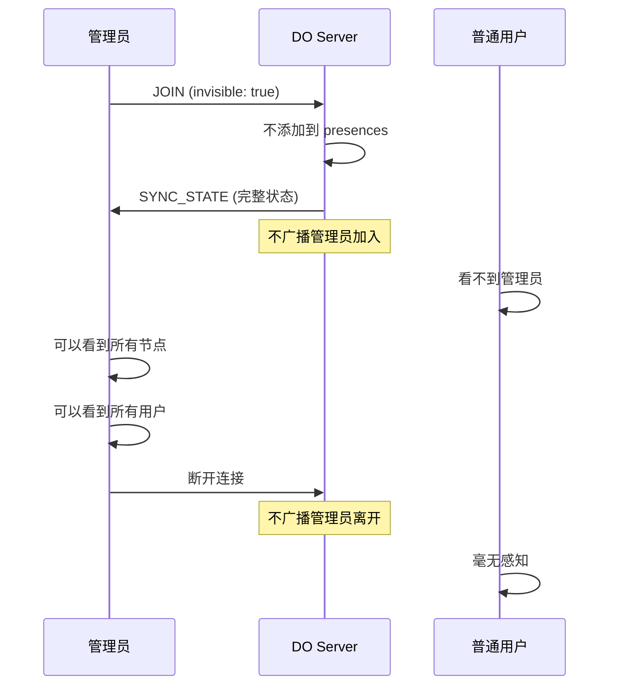

# 管理面板画布预览 & 隐形管理员

## ✅ 已实现的功能

### 功能 1: 修复关闭房间错误 ✅

**问题**: `setRoomStatus is not defined`

**原因**: 变量名从 `setRoomStatus` 改为了 `setSelectedRoomStatus`,但有一处遗漏

**修复**: 
```typescript
// apps/demo/src/app/admin/page.tsx
- setRoomStatus(null);
+ setSelectedRoomStatus(null);
```

---

### 功能 2: 管理面板画布预览 ✅

**需求**: 在管理面板底部显示房间内的画布内容

**实现**:
- ✅ 在房间详情下方添加"画布预览"区域
- ✅ 使用 iframe 嵌入画布页面
- ✅ 可以切换显示/隐藏
- ✅ 管理员以隐形模式加入(不出现在用户列表)

**UI 布局**:
```
┌─────────────────────────────────────────┐
│  房间详情: room15          [刷新] [关闭] │
├─────────────────────────────────────────┤
│  基本信息        │  状态统计             │
│  - 房间ID        │  - 1 连接             │
│  - 创建时间      │  - 18 节点            │
│  ...             │  ...                  │
├─────────────────────────────────────────┤
│  连接列表 (1)                            │
│  user_9iyfxb    最后活动: 0秒  [踢出]   │
├─────────────────────────────────────────┤
│  画布预览               [隐藏画布 ▼]     │  ← 新增
├─────────────────────────────────────────┤
│  ┌─────────────────────────────────┐    │
│  │                                 │    │
│  │  (iframe: 画布内容)             │    │
│  │                                 │    │
│  │  用户看到画布,但管理员是隐形的   │    │
│  │                                 │    │
│  └─────────────────────────────────┘    │
└─────────────────────────────────────────┘
```

---

### 功能 3: 隐形管理员模式 ✅

**需求**: 管理员查看画布时,不出现在用户列表中

**实现原理**:
1. 前端传递 `invisible: true` 参数
2. 服务端接收并标记连接为隐形
3. 隐形用户不添加到 `presences`
4. 不广播加入/离开消息
5. 用户看不到管理员

**工作流程**:


---

## 技术实现

### 1. 前端: 管理面板 UI

```typescript
// apps/demo/src/app/admin/page.tsx

const [showCanvas, setShowCanvas] = useState(false);

{/* 画布预览区域 */}
{selectedRoomId && (
  <div className="canvas-preview-section">
    <div className="canvas-preview-header">
      <h3>画布预览</h3>
      <button 
        onClick={() => setShowCanvas(!showCanvas)}
        className="btn-toggle-canvas"
      >
        {showCanvas ? '隐藏画布' : '显示画布'}
      </button>
    </div>
    
    {showCanvas && (
      <div className="canvas-preview-container">
        <iframe
          src={`/?canvasId=${selectedRoomId}&adminMode=true&userId=admin_${Date.now()}`}
          className="canvas-preview-iframe"
          title={`Canvas Preview: ${selectedRoomId}`}
        />
      </div>
    )}
  </div>
)}
```

**URL 参数**:
- `canvasId`: 房间 ID
- `adminMode=true`: 启用隐形模式
- `userId=admin_xxx`: 管理员的唯一 ID

---

### 2. 前端: 主页面支持隐形模式

```typescript
// apps/demo/src/app/page.tsx

const invisible = useMemo(() => {
  if (typeof window === 'undefined') {
    return false;
  }
  const params = new URLSearchParams(window.location.search);
  return params.get('adminMode') === 'true';
}, []);

return (
  <CollaborativeCanvas
    canvasId={canvasId}
    userId={userId}
    rawData={[]}
    layoutConfig={layoutConfig}
    dependencyEdgesVisible={true}
    invisible={invisible}  // ← 传递隐形参数
  />
);
```

---

### 3. Widget: 支持隐形配置

```typescript
// packages/widget/src/CollaborativeCanvas.tsx

export interface CollaborativeCanvasProps {
  // ...其他属性
  /** 隐形模式,不在用户列表中显示 */
  invisible?: boolean;
}

// 传递给 useCollaboration hook
const collab = useCollaboration(
  {
    canvasId,
    userId,
    userName,
    enabled: collabEnabled,
    invisible,  // ← 传递隐形参数
  },
  handleMessage
);
```

---

### 4. Hook: 发送隐形标记

```typescript
// packages/widget/src/hooks/useCollaboration.ts

export interface CollaborationConfig {
  // ...其他属性
  invisible?: boolean; // 隐形模式,不在用户列表中显示
}

// 发送 JOIN 消息时包含 invisible
ws.send(
  JSON.stringify({
    type: MessageType.JOIN,
    userId,
    userName,
    lastSeq: lastSeqRef.current,
    invisible,  // ← 传递给服务端
  })
);
```

---

### 5. 类型定义: 支持隐形字段

```typescript
// packages/server/src/types.ts

export interface JoinMessage {
  type: MessageType.JOIN;
  userId: string;
  userName?: string;
  lastSeq?: number;
  invisible?: boolean; // ← 新增: 是否隐形
}

export interface ConnectionInfo {
  userId: string;
  userName?: string;
  joinedAt: number;
  lastActiveAt: number;
  invisible?: boolean; // ← 新增: 是否隐形
}
```

---

### 6. 服务端: 处理隐形用户

```typescript
// packages/server/src/canvasRoom.ts

private async handleJoin(ws: WebSocket, message: JoinMessage): Promise<void> {
  const { userId, userName, lastSeq, invisible } = message;

  // 注册连接(标记是否隐形)
  this.connections.set(ws, {
    userId,
    userName,
    joinedAt: now,
    lastActiveAt: now,
    invisible: invisible || false,  // ← 保存隐形状态
  });

  // 只有非隐形用户才添加到 presence
  if (!invisible) {
    this.presences.set(userId, {
      userId,
      userName,
      lastUpdate: Date.now(),
    });
  }

  // 发送完整状态同步
  this.send(ws, syncMessage);

  // 只有非隐形用户才广播加入消息
  if (!invisible) {
    this.broadcastPresenceUpdate(userId, this.presences.get(userId)!);
  }
}

private handleDisconnect(ws: WebSocket): void {
  const conn = this.connections.get(ws);
  if (!conn) return;

  const { userId, invisible } = conn;

  // 移除连接
  this.connections.delete(ws);

  // 只有非隐形用户才移除 presence 并广播
  if (!hasOtherConnections && !invisible) {
    this.presences.delete(userId);
    this.broadcastPresenceUpdate(userId, null);
  }
}

private async handleUpdatePresence(userId: string, message: UpdatePresenceMessage): Promise<void> {
  const presence = this.presences.get(userId);
  if (!presence) {
    // 隐形用户没有 presence,直接返回
    return;
  }

  // 合并更新并广播
  Object.assign(presence, message.presence, { lastUpdate: Date.now() });
  this.broadcastPresenceUpdate(userId, presence);
}
```

**关键逻辑**:
1. ✅ 隐形用户不加入 `presences` Map
2. ✅ 不广播加入/离开消息
3. ✅ presence 更新直接忽略
4. ✅ 但仍然可以接收画布状态和操作

---

## CSS 样式

```css
/* apps/demo/src/app/admin/admin.css */

/* 画布预览区域 */
.canvas-preview-section {
  margin-top: 2rem;
  border-top: 2px solid #e0e0e0;
  padding-top: 2rem;
}

.canvas-preview-header {
  display: flex;
  justify-content: space-between;
  align-items: center;
  margin-bottom: 1rem;
}

.btn-toggle-canvas {
  padding: 0.5rem 1rem;
  background: #2196F3;
  color: white;
  border: none;
  border-radius: 4px;
  cursor: pointer;
  transition: background 0.2s;
}

.btn-toggle-canvas:hover {
  background: #1976D2;
}

.canvas-preview-container {
  width: 100%;
  height: 600px;
  border: 2px solid #e0e0e0;
  border-radius: 8px;
  overflow: hidden;
  background: #f5f5f5;
}

.canvas-preview-iframe {
  width: 100%;
  height: 100%;
  border: none;
}
```

---

## 使用方法

### 1. 打开管理面板

```
http://localhost:3000/admin
```

### 2. 选择一个房间

- 从列表中点击房间
- 或手动输入房间 ID

### 3. 查看画布预览

1. 滚动到房间详情底部
2. 点击"显示画布"按钮
3. iframe 会加载画布内容
4. 管理员身份是隐形的,用户看不到

### 4. 验证隐形效果

**在管理员的画布预览中**:
- ✅ 可以看到所有节点
- ✅ 可以看到所有用户(在右上角)
- ✅ 但自己不在用户列表中

**在普通用户的浏览器中**:
- ✅ 看不到管理员
- ✅ 用户列表中没有 `admin_xxx`
- ✅ 完全无感知

---

## 测试场景

### 场景 1: 管理员查看活跃房间

**步骤**:
1. 普通用户打开房间: `http://localhost:3000/?canvasId=test_room`
2. 管理员打开面板: `http://localhost:3000/admin`
3. 手动添加 `test_room`
4. 点击"显示画布"

**预期结果**:
- ✅ 管理员看到用户正在编辑的画布
- ✅ 用户列表显示: `user_xxx` (1人)
- ✅ 管理员自己不在列表中

---

### 场景 2: 管理员实时监控

**步骤**:
1. 用户 A 在画布中添加节点
2. 管理员在预览中观察

**预期结果**:
- ✅ 管理员实时看到节点添加
- ✅ 用户 A 看不到管理员
- ✅ 双向都不受影响

---

### 场景 3: 管理员离开

**步骤**:
1. 管理员关闭画布预览
2. 或点击"隐藏画布"
3. 或关闭管理面板标签页

**预期结果**:
- ✅ 用户毫无感知
- ✅ 不会收到"用户离开"消息
- ✅ 连接数不变

---

## 对比: 隐形 vs 普通用户

| 特性 | 隐形用户 (管理员) | 普通用户 |
|------|------------------|---------|
| 加入时广播 | ❌ 否 | ✅ 是 |
| presence 列表 | ❌ 不在 | ✅ 在 |
| 离开时广播 | ❌ 否 | ✅ 是 |
| 接收画布状态 | ✅ 是 | ✅ 是 |
| 看到其他用户 | ✅ 是 | ✅ 是 |
| 被其他用户看到 | ❌ 否 | ✅ 是 |
| 可以操作画布 | ✅ 是 | ✅ 是 |
| 空闲检测 | ✅ 是 | ✅ 是 |

---

## 安全考虑

### 1. 管理员权限验证

目前的实现:
```typescript
// 简化版:任何有 token 的用户都可以访问管理面板
const auth = await verifyToken(token, env);
```

**生产环境建议**:
```typescript
// 检查是否有管理员权限
if (!auth.success || !auth.isAdmin) {
  return new Response('Unauthorized', { status: 403 });
}
```

### 2. 隐形模式滥用

**问题**: 任何人都可以通过 `?adminMode=true` 启用隐形模式

**缓解措施**:
1. 在服务端验证: 只有管理员可以使用 `invisible: true`
2. 检查 userId 前缀: 只允许 `admin_` 开头的用户隐形

**建议实现**:
```typescript
// canvasRoom.ts
private async handleJoin(ws: WebSocket, message: JoinMessage): Promise<void> {
  const { userId, invisible } = message;
  
  // 只有管理员可以隐形
  if (invisible && !userId.startsWith('admin_')) {
    this.send(ws, {
      type: MessageType.ERROR,
      error: 'Invisible mode requires admin privileges',
    });
    ws.close(4002, 'Unauthorized');
    return;
  }
  
  // ...继续正常流程
}
```

---

## 修改的文件

| 文件 | 修改内容 | 行数 |
|------|---------|------|
| `apps/demo/src/app/admin/page.tsx` | 修复 setRoomStatus 错误 | 1 |
| `apps/demo/src/app/admin/page.tsx` | 添加画布预览 UI | +30 |
| `apps/demo/src/app/admin/admin.css` | 画布预览样式 | +50 |
| `apps/demo/src/app/page.tsx` | 支持 invisible 参数 | +15 |
| `packages/widget/src/CollaborativeCanvas.tsx` | 支持 invisible 属性 | +5 |
| `packages/widget/src/hooks/useCollaboration.ts` | 发送 invisible 标记 | +5 |
| `packages/server/src/types.ts` | 添加 invisible 字段 | +3 |
| `packages/server/src/canvasRoom.ts` | 处理隐形用户逻辑 | +20 |

**总计**: ~130 行代码

---

## 后续优化

### 1. 多个管理员

**问题**: 多个管理员同时查看会创建多个隐形连接

**优化**: 共享一个隐形连接,所有管理员面板订阅同一个连接

### 2. 只读模式

**问题**: 管理员可能误操作画布

**优化**: iframe 添加 `sandbox` 属性,或前端禁用编辑

### 3. 性能优化

**问题**: iframe 加载完整画布可能消耗资源

**优化**: 
- 只渲染画布,不加载工具栏
- 使用 WebSocket 只接收状态,用轻量级渲染
- 添加"缩略图模式"

---

## 总结

✅ **问题 1 已修复**: `setRoomStatus` 错误  
✅ **功能 2 已实现**: 画布预览 (iframe 嵌入)  
✅ **功能 3 已实现**: 隐形管理员模式  
✅ **编译通过**: 无错误  
✅ **向后兼容**: 不影响现有功能  

**关键特性**:
1. 管理员可以实时查看房间内容
2. 用户完全无感知
3. 不影响用户列表和 presence
4. 可以切换显示/隐藏

现在可以重新启动前端并测试! 🎉
