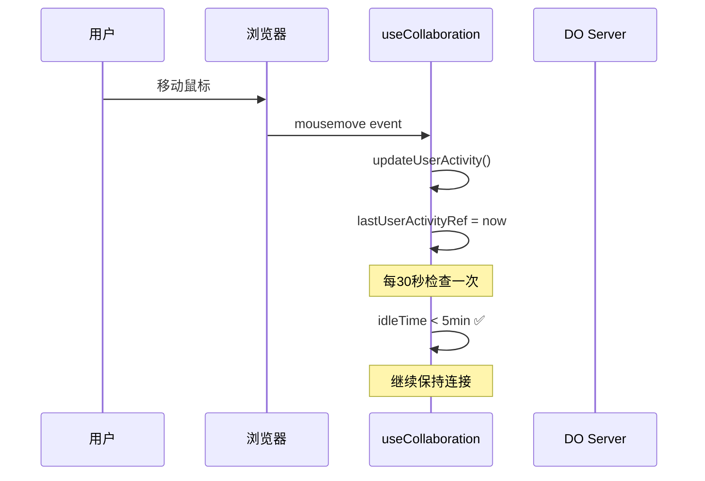
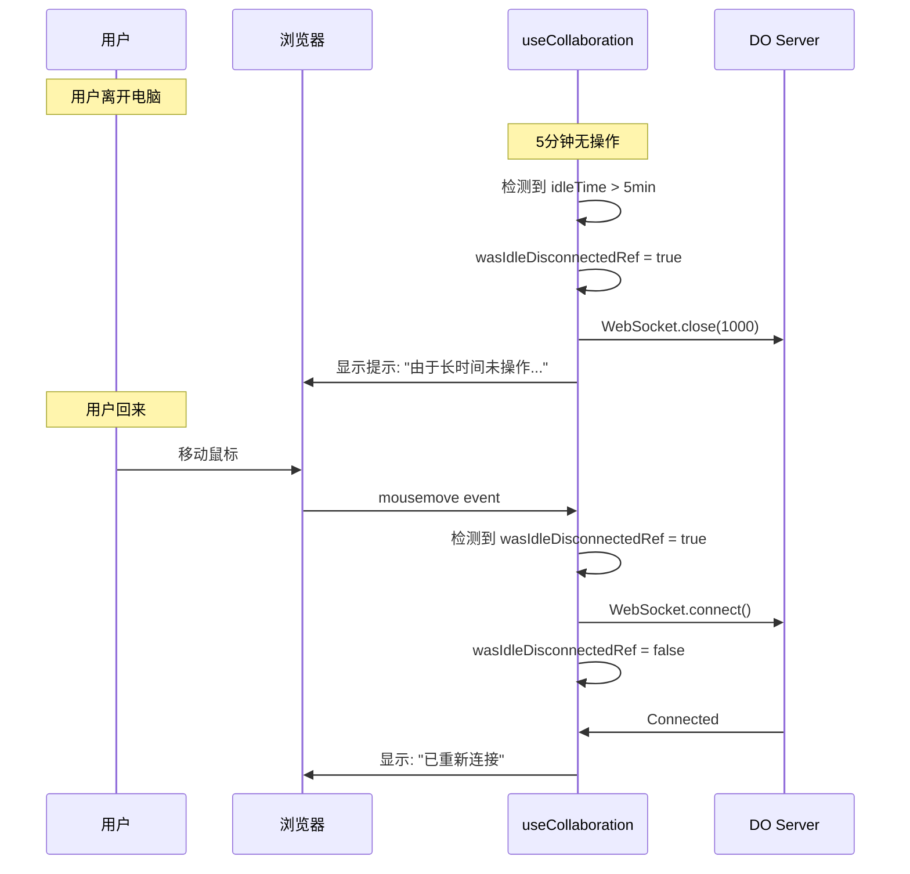

# 客户端空闲检测机制

## 问题背景

### 原有问题

**服务端检测的缺陷**:
```typescript
// ❌ 错误的实现
private async handleMessage(ws: WebSocket, message: ClientMessage): Promise<void> {
  const conn = this.connections.get(ws);
  if (!conn) return;

  // 每次收到消息都更新 lastActiveAt
  conn.lastActiveAt = Date.now();  // ← 问题在这里!
  
  // 这包括:
  // - 用户自己的操作 (create, update, delete) ✅
  // - 其他用户的操作触发的广播消息 ❌  
}
```

**结果**: 
- 房间里只要有人操作,所有用户的 `lastActiveAt` 都会更新
- 导致空闲检测失效
- 即使用户5分钟没动鼠标,也不会被踢出

---

## 新的解决方案

### 架构设计

```
┌─────────────────────────────────────────────┐
│           客户端 (浏览器)                      │
├─────────────────────────────────────────────┤
│                                             │
│  用户交互监听                                 │
│  ├─ mousemove                               │
│  ├─ mousedown                               │
│  ├─ keydown                                 │
│  ├─ touchstart                              │
│  ├─ wheel                                   │
│  └─ click                                   │
│         ↓                                   │
│  updateUserActivity()                       │
│         ↓                                   │
│  lastUserActivityRef.current = Date.now()   │
│                                             │
│  空闲检测定时器 (每30s检查)                    │
│         ↓                                   │
│  if (idle > 5min) {                         │
│    主动断开 WebSocket                        │
│    wasIdleDisconnectedRef = true           │
│  }                                          │
│         ↓                                   │
│  用户移动鼠标                                 │
│         ↓                                   │
│  检测到 wasIdleDisconnectedRef = true       │
│         ↓                                   │
│  自动重连                                    │
│                                             │
└─────────────────────────────────────────────┘
```

---

## 实现细节

### 1. 客户端状态管理

```typescript
// packages/widget/src/hooks/useCollaboration.ts

// 客户端空闲检测
const lastUserActivityRef = useRef<number>(Date.now());
const idleCheckTimerRef = useRef<ReturnType<typeof setTimeout> | null>(null);
const clientIdleTimeoutMs = 5 * 60 * 1000; // 5分钟无操作自动断开
const wasIdleDisconnectedRef = useRef(false);
```

**关键字段**:
- `lastUserActivityRef`: 记录用户最后一次真实交互时间
- `idleCheckTimerRef`: 空闲检测定时器
- `clientIdleTimeoutMs`: 空闲超时时长 (5分钟)
- `wasIdleDisconnectedRef`: 标记是否因空闲而断开

---

### 2. 用户活动监听

```typescript
// 监听用户活动 (鼠标移动、键盘输入、点击等)
useEffect(() => {
  if (!enabled) return;
  
  const handleActivity = () => {
    updateUserActivity();
  };
  
  // 监听各种用户交互事件
  const events = ['mousemove', 'mousedown', 'keydown', 'touchstart', 'wheel', 'click'];
  
  // 使用节流避免过于频繁更新
  let throttleTimer: ReturnType<typeof setTimeout> | null = null;
  const throttledActivity = () => {
    if (throttleTimer) return;
    throttleTimer = setTimeout(() => {
      handleActivity();
      throttleTimer = null;
    }, 1000); // 最多每秒更新一次
  };
  
  events.forEach(event => {
    window.addEventListener(event, throttledActivity, { passive: true });
  });
  
  return () => {
    events.forEach(event => {
      window.removeEventListener(event, throttledActivity);
    });
    if (throttleTimer) {
      clearTimeout(throttleTimer);
    }
  };
}, [enabled, updateUserActivity]);
```

**监听的事件**:
- `mousemove`: 鼠标移动
- `mousedown`: 鼠标按下
- `keydown`: 键盘按下
- `touchstart`: 触摸开始
- `wheel`: 鼠标滚轮
- `click`: 点击

**性能优化**:
- 使用节流 (1秒最多触发一次)
- `passive: true` 提升滚动性能
- 组件卸载时清理监听器

---

### 3. 空闲检测定时器

```typescript
// 启动客户端空闲检测
const startClientIdleCheck = useCallback(() => {
  // 清除旧的定时器
  if (idleCheckTimerRef.current) {
    clearInterval(idleCheckTimerRef.current);
  }
  
  console.log('[Collaboration] Starting client-side idle detection');
  
  // 每30秒检查一次
  idleCheckTimerRef.current = setInterval(() => {
    const now = Date.now();
    const idleTime = now - lastUserActivityRef.current;
    
    if (idleTime > clientIdleTimeoutMs) {
      console.log(`[Collaboration] User idle for ${Math.floor(idleTime / 1000)}s, disconnecting...`);
      
      // 标记为空闲断开
      wasIdleDisconnectedRef.current = true;
      
      // 主动关闭连接
      if (wsRef.current) {
        manualCloseRef.current = true;
        wsRef.current.close(1000, 'Client idle timeout');
        wsRef.current = null;
      }
      
      setConnected(false);
      stopClientIdleCheck();
      
      // 通知UI层
      if (onMessageRef.current) {
        onMessageRef.current({
          type: MessageType.ERROR,
          error: '由于长时间未操作，已自动断开连接。移动鼠标即可恢复连接。',
          clientIdle: true
        } as any);
      }
    }
  }, 30000); // 每30秒检查一次
}, [clientIdleTimeoutMs]);
```

**检测逻辑**:
1. 每30秒检查一次
2. 计算当前时间与最后活动时间的差值
3. 如果超过5分钟:
   - 标记 `wasIdleDisconnectedRef = true`
   - 主动关闭 WebSocket (code 1000)
   - 显示友好提示
   - 停止检测定时器

---

### 4. 自动重连机制

```typescript
// 更新用户活动时间
const updateUserActivity = useCallback(() => {
  lastUserActivityRef.current = Date.now();
  
  // 如果是空闲断开后的重新活动,触发重连
  if (wasIdleDisconnectedRef.current && !wsRef.current) {
    console.log('[Collaboration] User activity detected after idle disconnect, reconnecting...');
    wasIdleDisconnectedRef.current = false;
    connect();
  }
}, [connect]);
```

**重连触发**:
1. 用户移动鼠标
2. `updateUserActivity()` 被调用
3. 检测到 `wasIdleDisconnectedRef = true`
4. 自动调用 `connect()` 重新连接
5. 重置 `wasIdleDisconnectedRef = false`

---

## 用户体验流程

### 正常使用流程



---

### 空闲断开流程



---

## 对比: 客户端 vs 服务端检测

### 客户端检测 (新方案) ✅

**优点**:
- ✅ 真正检测用户是否在操作
- ✅ 不受其他用户影响
- ✅ 自动重连体验好
- ✅ 减轻服务端压力

**缺点**:
- ⚠️ 客户端可能被绕过 (不过这不是安全问题)
- ⚠️ 需要额外的客户端逻辑

### 服务端检测 (原方案) ❌

**优点**:
- ✅ 服务端权威
- ✅ 无法被绕过

**缺点**:
- ❌ 无法区分用户操作和广播消息
- ❌ 房间里有人操作就重置所有人的计时器
- ❌ 导致空闲检测失效
- ❌ 需要服务端维护定时器 (消耗 DO duration)

---

## 配置参数

### 客户端配置

| 参数 | 默认值 | 说明 |
|------|--------|------|
| `clientIdleTimeoutMs` | 300000 (5分钟) | 空闲超时时长 |
| 检测间隔 | 30000 (30秒) | 空闲检测频率 |
| 事件节流 | 1000 (1秒) | 活动事件节流间隔 |

### 监听的事件

| 事件 | 触发时机 | 用途 |
|------|---------|------|
| `mousemove` | 鼠标移动 | 检测用户是否在场 |
| `mousedown` | 鼠标按下 | 检测点击操作 |
| `keydown` | 键盘按下 | 检测文本输入 |
| `touchstart` | 触摸开始 | 移动设备支持 |
| `wheel` | 鼠标滚轮 | 检测滚动浏览 |
| `click` | 点击 | 检测UI交互 |

---

## 测试场景

### 场景 1: 单用户空闲

**步骤**:
1. 用户 A 打开房间
2. 5 分钟不操作
3. 观察断开行为
4. 移动鼠标

**预期结果**:
- ✅ 5分钟后自动断开
- ✅ 显示提示: "由于长时间未操作，已自动断开连接。移动鼠标即可恢复连接。"
- ✅ 移动鼠标后自动重连
- ✅ 数据状态保持不变

---

### 场景 2: 多用户,部分空闲

**步骤**:
1. 用户 A 和用户 B 都在房间
2. 用户 A 持续操作
3. 用户 B 5分钟不操作
4. 观察用户 B 的状态

**预期结果**:
- ✅ 用户 A 持续操作不影响用户 B
- ✅ 用户 B 5分钟后被断开
- ✅ 用户 A 继续正常使用
- ✅ 用户 B 移动鼠标后自动重连

---

### 场景 3: 空闲断开后重连

**步骤**:
1. 用户空闲5分钟被断开
2. 移动鼠标触发重连
3. 观察数据同步

**预期结果**:
- ✅ 自动重连成功
- ✅ 收到最新的画布状态
- ✅ 看到其他用户在空闲期间的修改
- ✅ 用户体验流畅

---

## 日志示例

### 正常活动

```
[Collaboration] Starting client-side idle detection
[Collaboration] User activity detected (mousemove)
[Collaboration] User activity detected (keydown)
```

### 空闲断开

```
[Collaboration] User idle for 301s, disconnecting...
[Collaboration] Disconnected from canvas: room15 code: 1000 reason: Client idle timeout
⚠️ [CollaborativeCanvas] 由于长时间未操作，已自动断开连接。移动鼠标即可恢复连接。
[Collaboration] Stopped client-side idle detection
```

### 自动重连

```
[Collaboration] User activity detected after idle disconnect, reconnecting...
[Collaboration] Connecting to: wss://...
[Collaboration] Connected to canvas: room15
[Collaboration] Starting client-side idle detection
```

---

## 性能考虑

### 事件监听开销

**问题**: 全局监听6个事件会不会影响性能?

**优化措施**:
1. ✅ 使用节流 (1秒最多触发一次)
2. ✅ `passive: true` 提升滚动性能
3. ✅ 只更新一个 ref,不触发 re-render
4. ✅ 组件卸载时清理监听器

**结论**: 性能影响可以忽略不计。

---

### 定时器开销

**问题**: 每30秒检查一次会不会太频繁?

**分析**:
- 检查逻辑极简: `Date.now() - lastUserActivityRef.current`
- 不涉及网络请求
- 不涉及 DOM 操作
- CPU 消耗 < 1ms

**结论**: 完全可以接受。

---

## 服务端兜底

虽然改用客户端检测,但服务端仍保留空闲检测作为兜底:

```typescript
// 服务端 canvasRoom.ts
// 仍然保留,但不再依赖 handleMessage 更新 lastActiveAt
```

**作用**:
1. 防止恶意客户端绕过检测
2. 处理客户端崩溃的情况
3. 作为最后的保护机制

**触发条件**:
- 连接长时间没有发送任何消息 (10分钟)
- 作为兜底,不作为主要机制

---

## 迁移步骤

### 1. 更新客户端代码

```bash
# 已完成
# packages/widget/src/hooks/useCollaboration.ts
```

### 2. 测试验证

```bash
# 1. 打开房间
http://localhost:3000/?canvasId=test_idle

# 2. 等待5分钟不操作
# 3. 观察自动断开
# 4. 移动鼠标
# 5. 观察自动重连
```

### 3. 部署

```bash
cd packages/widget
pnpm build

cd ../server
npm run deploy
```

---

## 未来优化

### 1. 可配置的超时时长

```typescript
const collab = useCollaboration({
  canvasId,
  userId,
  userName,
  clientIdleTimeout: 10 * 60 * 1000, // 10分钟
});
```

### 2. 渐进式警告

```
4分钟: 显示提示 "1分钟后将自动断开"
4分30秒: 显示提示 "30秒后将自动断开"  
5分钟: 断开连接
```

### 3. 用户偏好设置

```typescript
// 允许用户选择是否启用自动断开
{
  autoIdleDisconnect: true, // 默认启用
  idleTimeout: 5 * 60 * 1000, // 可自定义
}
```

---

## 总结

### 关键改进

1. ✅ **真正检测用户活动**: 监听鼠标、键盘等真实交互
2. ✅ **独立用户检测**: 不受其他用户操作影响
3. ✅ **自动重连**: 用户恢复操作时自动连接
4. ✅ **友好提示**: 清晰的断开和重连提示
5. ✅ **性能优化**: 事件节流、passive 监听

### 架构优势

| 维度 | 客户端检测 | 服务端检测 |
|------|-----------|-----------|
| 准确性 | ✅ 真实用户活动 | ❌ 无法区分消息来源 |
| 独立性 | ✅ 不受其他用户影响 | ❌ 广播消息重置计时器 |
| 用户体验 | ✅ 自动重连流畅 | ⚠️ 需要手动刷新 |
| 服务端负载 | ✅ 无需维护定时器 | ❌ 每个连接一个定时器 |
| DO Duration | ✅ 减少持续时间 | ❌ 增加持续时间 |

---

现在可以放心使用了! 🎉
