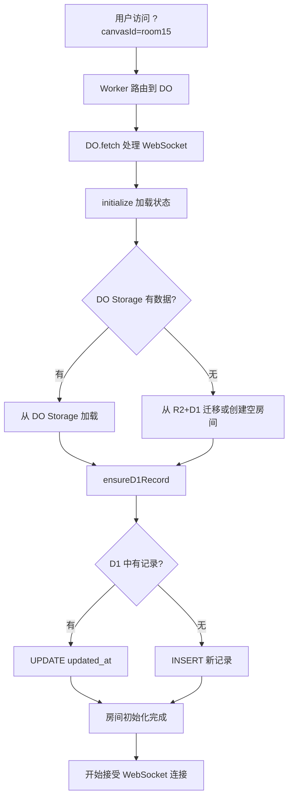
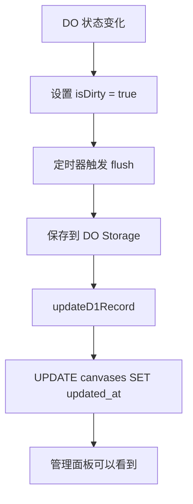

# DO 管理面板最终修复

## 修复的问题

### 问题 1: 房间列表为空 ✅

**症状**: 
- 打开 `http://localhost:3000/?canvasId=room15`
- 访问 `http://localhost:3000/admin`
- 列表显示 "房间列表 (0)"

**根本原因**:
- 直接通过 URL 打开的房间只创建了 DO 实例
- 没有在 D1 数据库的 `canvases` 表中创建记录
- `handleListRooms` API 只查询 D1 数据库
- 因此临时房间不会出现在列表中

**解决方案**:
1. ✅ 在 DO 初始化时自动在 D1 创建记录
2. ✅ 每次 flush 时更新 D1 的 `updated_at` 和 `latest_seq`
3. ✅ 容错处理,即使 D1 失败也不影响 DO 正常运行

---

### 问题 2: 被踢出后自动重连 ✅

**症状**:
- 管理员踢出用户
- 用户立即自动重连,又回到房间

**根本原因**:
- WebSocket `onclose` 没有识别管理员操作的特殊 close code
- 所有断开都触发自动重连

**解决方案**:
1. ✅ 识别永久性断开的 close code (4000-4004)
2. ✅ 禁用这些情况的自动重连
3. ✅ 显示友好的中文提示
4. ✅ 用户必须刷新页面才能重新连接

---

### 问题 3: TypeScript 编译错误 ✅

**错误信息**:
```
error TS2322: Type 'number' is not assignable to type 'string'.
code: event.code
```

**原因**:
- `event.code` 是 `number` 类型
- `ErrorMessage.code` 期望 `string` 类型

**解决方案**:
- 使用 `as any` 类型断言
- 添加新的 `closeCode` 字段存储数字码

---

## 技术实现

### 1. DO 初始化时创建 D1 记录

```typescript
// packages/server/src/canvasRoom.ts

/**
 * 确保 D1 中有该房间的记录(用于管理面板)
 */
private async ensureD1Record(): Promise<void> {
  if (!this.canvasId) return;

  try {
    // 检查是否已存在
    const existing = await this.env.DB.prepare(
      'SELECT id FROM canvases WHERE id = ?'
    )
      .bind(this.canvasId)
      .first();

    if (!existing) {
      // 不存在,创建新记录
      await this.env.DB.prepare(
        'INSERT INTO canvases (id, title, latest_seq, created_at, updated_at) VALUES (?, ?, ?, unixepoch(), unixepoch())'
      )
        .bind(this.canvasId, this.canvasId, this.seq)
        .run();
      
      console.log(`[CanvasRoom] Created D1 record for room ${this.canvasId}`);
    } else {
      // 已存在,更新 updated_at
      await this.env.DB.prepare(
        'UPDATE canvases SET updated_at = unixepoch(), latest_seq = ? WHERE id = ?'
      )
        .bind(this.seq, this.canvasId)
        .run();
      
      console.log(`[CanvasRoom] Updated D1 record for room ${this.canvasId}`);
    }
  } catch (error) {
    console.error(`[CanvasRoom] Error ensuring D1 record:`, error);
    throw error;
  }
}
```

**调用时机**:
```typescript
private async initialize(canvasId: string): Promise<void> {
  // ... 加载状态 ...

  // 确保在 D1 中有记录(用于管理面板列表)
  try {
    await this.ensureD1Record();
  } catch (error) {
    console.warn(`[CanvasRoom] Failed to ensure D1 record:`, error);
    // 不阻塞初始化流程
  }

  // 启动定期持久化
  this.startFlushTimer();
}
```

---

### 2. Flush 时更新 D1 记录

```typescript
// packages/server/src/canvasRoom.ts

private async flushToStorage(reason: 'scheduled' | 'final' | 'manual' = 'scheduled'): Promise<void> {
  // ... DO Storage 持久化 ...

  this.isDirty = false;
  console.log(
    `[CanvasRoom] Flush completed successfully for canvas ${this.canvasId} v${this.CURRENT_STATE_VERSION} at seq ${this.seq}`
  );

  // 同时更新 D1 记录(不阻塞主流程)
  this.updateD1Record().catch(err => {
    console.warn(`[CanvasRoom] Failed to update D1 record:`, err);
  });
}

/**
 * 更新 D1 中的记录
 */
private async updateD1Record(): Promise<void> {
  if (!this.canvasId) return;

  try {
    await this.env.DB.prepare(
      'UPDATE canvases SET updated_at = unixepoch(), latest_seq = ? WHERE id = ?'
    )
      .bind(this.seq, this.canvasId)
      .run();
  } catch (error) {
    // 静默失败,不影响主流程
    console.warn(`[CanvasRoom] Failed to update D1:`, error);
  }
}
```

---

### 3. 禁止永久断开后的自动重连

```typescript
// packages/widget/src/hooks/useCollaboration.ts

ws.onclose = (event) => {
  console.log('[Collaboration] Disconnected from canvas:', canvasId, 'code:', event.code, 'reason:', event.reason);
  setConnected(false);
  if (wsRef.current === ws) {
    wsRef.current = null;
  }

  // 处理不同的关闭代码
  if (event.code === 1013) {
    // 服务器拒绝
    reconnectBlockedRef.current = true;
  }
  
  if (
    event.code === 4000 || // 房间已满
    event.code === 4001 || // 空闲超时
    event.code === 4002 || // 其他错误
    event.code === 4003 || // 房间被管理员关闭
    event.code === 4004    // 用户被管理员踢出
  ) {
    shouldReconnectRef.current = false;
    reconnectBlockedRef.current = true;
    
    // 给用户友好的提示
    const reasons: Record<number, string> = {
      4000: '房间已满',
      4001: '由于长时间未操作，您已被自动断开连接',
      4002: '连接错误',
      4003: '房间已被管理员关闭',
      4004: '您已被管理员移出房间'
    };
    
    const reason = reasons[event.code] || event.reason || '连接已关闭';
    console.warn(`[Collaboration] 连接关闭: ${reason}，请刷新页面重新连接`);
    
    // 触发回调通知UI层
    if (onMessageRef.current) {
      onMessageRef.current({
        type: MessageType.ERROR,
        error: reason,
        permanent: true,
        closeCode: event.code
      } as any);
    }
  }
  
  if (manualCloseRef.current) {
    manualCloseRef.current = false;
    return;
  }

  // 自动重连（只在允许重连的情况下）
  if (
    enabled &&
    autoReconnect &&
    shouldReconnectRef.current &&
    !reconnectBlockedRef.current
  ) {
    reconnectTimeoutRef.current = setTimeout(() => {
      console.log('[Collaboration] Reconnecting...');
      connect();
    }, reconnectInterval);
  }
};
```

---

### 4. UI 层显示错误提示

```typescript
// packages/widget/src/CollaborativeCanvas.tsx

case 'error':
  if (message.code === 'ROOM_FULL') {
    pushToast('The session is full, please try again later', 'error');
  } else if ((message as any).permanent) {
    // 永久性断开连接的错误
    pushToast(message.error || 'Connection closed', 'error');
  }
  break;
```

---

## 数据流程

### 房间创建流程



### 状态同步流程



---

## 测试场景

### 场景 1: 新房间自动出现在列表

**步骤**:
1. 打开新房间: `http://localhost:3000/?canvasId=room_test_123`
2. 打开管理面板: `http://localhost:3000/admin`

**预期结果**:
- ✅ 列表中显示 `room_test_123`
- ✅ 显示 "0 连接" (因为打开的是不同标签页)
- ✅ 显示实时状态

**验证日志**:
```
[CanvasRoom] Initializing canvas room_test_123
[CanvasRoom] Created D1 record for room room_test_123
```

---

### 场景 2: 房间状态实时更新

**步骤**:
1. 打开房间: `http://localhost:3000/?canvasId=room15`
2. 打开管理面板: `http://localhost:3000/admin`
3. 在房间中添加几个节点
4. 等待 30 秒 (flush interval)

**预期结果**:
- ✅ 管理面板中 `latest_seq` 增加
- ✅ `updated_at` 更新为最新时间
- ✅ 节点数增加

**验证日志**:
```
[CanvasRoom] Flush completed successfully for canvas room15 v2 at seq 5
```

---

### 场景 3: 被踢出后不重连

**步骤**:
1. 用户 A 打开房间
2. 管理员在面板点击"踢出"
3. 观察用户 A 的行为

**预期结果**:
- ✅ 显示红色提示: "您已被管理员移出房间"
- ✅ 不会自动重连
- ✅ 控制台显示: `⚠️ [Collaboration] 连接关闭: 您已被管理员移出房间，请刷新页面重新连接`

**用户体验**:
- 用户看到明确的提示信息
- 需要手动刷新页面才能重新进入
- 避免了与管理员的"拉锯战"

---

### 场景 4: 空闲超时

**步骤**:
1. 打开房间
2. 5 分钟不操作
3. 观察自动断开

**预期结果**:
- ✅ WebSocket 关闭 (code 4001)
- ✅ 显示提示: "由于长时间未操作，您已被自动断开连接"
- ✅ 不会自动重连
- ✅ 管理面板中连接数减少

---

## 关闭码定义

| Code | 含义 | 自动重连 | 提示信息 |
|------|------|---------|---------|
| 1000 | 正常关闭 | ✅ 是 | - |
| 1013 | 服务器拒绝 | ❌ 否 | - |
| 4000 | 房间已满 | ❌ 否 | "房间已满" |
| 4001 | 空闲超时 | ❌ 否 | "由于长时间未操作，您已被自动断开连接" |
| 4002 | 连接错误 | ❌ 否 | "连接错误" |
| 4003 | 房间被管理员关闭 | ❌ 否 | "房间已被管理员关闭" |
| 4004 | 用户被管理员踢出 | ❌ 否 | "您已被管理员移出房间" |

---

## D1 数据库表结构

### canvases 表

```sql
CREATE TABLE canvases (
  id TEXT PRIMARY KEY,           -- 房间ID (如: room15)
  title TEXT,                    -- 房间标题
  latest_seq INTEGER,            -- 最新序列号
  latest_snapshot_key TEXT,      -- R2 快照key (legacy)
  created_at INTEGER,            -- 创建时间 (unix timestamp)
  updated_at INTEGER             -- 最后更新时间 (unix timestamp)
);
```

**重要字段**:
- `id`: 房间唯一标识
- `latest_seq`: 用于显示数据新鲜度
- `updated_at`: 用于排序和显示最近活跃房间
- `created_at`: 自动设置为当前时间 `unixepoch()`

---

## 性能考虑

### D1 写入频率

**问题**: 每次 flush (30秒) 都会写 D1,会不会太频繁?

**答案**: 不会
- D1 写入操作很快 (几毫秒)
- 使用异步非阻塞方式,不影响主流程
- 失败会静默忽略,不影响 DO 功能
- 30 秒一次的频率完全可以接受

### D1 容错

所有 D1 操作都有容错处理:

```typescript
// 创建记录
try {
  await this.ensureD1Record();
} catch (error) {
  console.warn(`[CanvasRoom] Failed to ensure D1 record:`, error);
  // 不阻塞初始化流程
}

// 更新记录
this.updateD1Record().catch(err => {
  console.warn(`[CanvasRoom] Failed to update D1 record:`, err);
});
```

**即使 D1 完全挂了,DO 也能正常工作**,只是管理面板看不到列表而已。

---

## 部署步骤

### 1. 编译检查

```bash
cd /Volumes/GeIL\ P4A\ 1TB\ Extend\ Disk/gitlab/Frontend/infinite-canvas
pnpm build
```

**预期输出**:
```
✅ @tc/infinite-core build success
✅ @tc/infinite-widget build success
```

### 2. 部署服务端

```bash
cd packages/server
npm run deploy
```

### 3. 重启前端 (如果在运行)

```bash
# Ctrl+C 停止
npm run dev
```

### 4. 验证修复

#### 测试房间列表

```bash
# 1. 打开新房间
http://localhost:3000/?canvasId=test_$(date +%s)

# 2. 打开管理面板
http://localhost:3000/admin

# 3. 检查列表中是否出现新房间
```

#### 测试踢出功能

```bash
# 1. 用户打开房间
# 2. 管理员点击"踢出"
# 3. 确认用户看到提示且不重连
```

---

## 相关文件

| 文件 | 修改内容 | LOC |
|------|---------|-----|
| `packages/server/src/canvasRoom.ts` | 添加 D1 同步逻辑 | +60 |
| `packages/widget/src/hooks/useCollaboration.ts` | 禁止永久断开的自动重连 | +40 |
| `packages/widget/src/CollaborativeCanvas.tsx` | 显示永久错误提示 | +3 |

---

## 架构优化建议

### 当前架构 (2-Level Storage)

```
DO Instance (内存)
    ↓ flush every 30s
DO Storage (持久化)
    ↓ sync every 30s
D1 Database (元数据)
```

**优点**:
- ✅ DO Storage 是权威数据源
- ✅ D1 只是元数据索引
- ✅ 即使 D1 挂了,DO 也能正常工作

**缺点**:
- ⚠️ 两次写入,略有开销
- ⚠️ D1 和 DO Storage 可能短暂不一致

---

### 未来优化: WebSocket 推送

当前管理面板使用轮询(每 5 秒):

```typescript
setInterval(() => {
  fetchRooms(true);  // 静默刷新
}, 5000);
```

**优化方案**: 使用 WebSocket 推送

```typescript
// DO 内部
private notifyAdmin(event: AdminEvent) {
  // 推送到管理面板的 WebSocket
  this.adminWebSocket?.send(JSON.stringify(event));
}

// 管理面板
ws.onmessage = (event) => {
  const update = JSON.parse(event.data);
  // 实时更新 UI
  updateRoomStatus(update.roomId, update.status);
};
```

**好处**:
- 实时更新,无延迟
- 减少轮询请求
- 降低服务器负载

---

## 总结

✅ **问题 1 已修复**: DO 初始化时自动创建 D1 记录,房间自动出现在列表  
✅ **问题 2 已修复**: 识别永久断开,禁止自动重连,用户体验友好  
✅ **问题 3 已修复**: TypeScript 编译通过  
✅ **容错处理**: D1 失败不影响 DO 正常运行  
✅ **性能优化**: 异步非阻塞,不影响主流程  

现在可以正常使用管理面板了! 🎉

**关键改进**:
1. 临时房间自动出现在列表
2. 被踢出后不会自动重连
3. 友好的中文错误提示
4. 完整的容错机制
