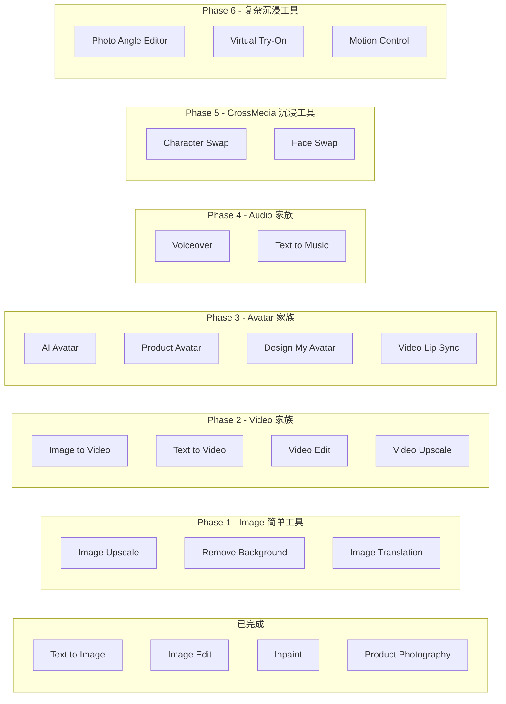

# 侧边栏小工具接入规划

## 当前进度

已完成 4 个：


| 工具                  | 类型              | 原组件                                |
| ------------------- | --------------- | ---------------------------------- |
| Text to Image       | Canvas Panel    | `feature/Image/AIImage`            |
| Image Edit          | Canvas Panel    | `feature/Image/AIImage`（同组件）       |
| Inpaint             | Immersive Modal | `feature/Image/Inpaint`            |
| Product Photography | Immersive Modal | `feature/Image/ProductPhotoGraphy` |


## 全量工具清单（21 个）

源码配置：`[ToolPanel/config/index.ts](apps/base/src/app/board/[id]/components/ToolPanel/config/index.ts)` 的 `TOOL_COMPONENTS` 映射。




---

## Phase 1: Image 简单 Canvas Panel 工具（3 个）

**预计工作量：每个 0.5-1 天**

这些都是表单型工具，UI 结构简单（上传图 + 参数选择 + 生成按钮）。


| 序号  | 工具                | ToolType            | 源码目录                              | 关键依赖                             |
| --- | ----------------- | ------------------- | --------------------------------- | -------------------------------- |
| 5   | Image Upscale     | `image-upscale`     | `feature/Image/ImageUpscale/`     | 分辨率选择、tRPC `imageUpscale` router |
| 6   | Remove Background | `remove-background` | 无独立组件（仅 ToolType 定义）              | 需自建面板或接 API                      |
| 7   | Image Translation | `image-translation` | `feature/Image/ImageTranslation/` | 语言选择、OCR API                     |


**每个工具的接入步骤（通用模板）：**

1. 从 `feature/Image/<ToolName>/` 复制表单组件
2. 将 Recoil atomFamily 改为 Zustand slice
3. 从 `data/task/useMutations.ts` 提取 API 调用，改为目标项目的请求方式
4. 注册到侧边栏 config（toolType -> component 映射）

---

## Phase 2: Video 家族 Canvas Panel（4 个）

**预计工作量：2-3 天（AIVideo 共享组件 + VideoUpscale）**

Image to Video / Text to Video / Video Edit 共用 `AIVideo` 组件（类似 AIImage 共用模式），VideoUpscale 独立。


| 序号  | 工具             | ToolType         | 源码目录                          |
| --- | -------------- | ---------------- | ----------------------------- |
| 8   | Image to Video | `image-to-video` | `feature/Video/AIVideo/`      |
| 9   | Text to Video  | `text-to-video`  | `feature/Video/AIVideo/`      |
| 10  | Video Edit     | `video-edit`     | `feature/Video/AIVideo/`      |
| 11  | Video Upscale  | `video-upscale`  | `feature/Video/VideoUpscale/` |


**关键点：**

- `AIVideo` 内部通过 tab 切换 Image to Video / Text to Video / Video Edit，与 `AIImage` 模式一致
- VideoUpscale 结构和 ImageUpscale 几乎一致，可参考 Phase 1 的 ImageUpscale

---

## Phase 3: Avatar 家族 Canvas Panel（4 个）

**预计工作量：3-4 天（Avatar 模板选择逻辑较复杂）**


| 序号  | 工具               | ToolType           | 源码目录                             |
| --- | ---------------- | ------------------ | -------------------------------- |
| 12  | AI Avatar        | `ai-avatar`        | `feature/Avatar/AiAvatar/`       |
| 13  | Product Avatar   | `product-avatar`   | `feature/Avatar/ProductAvatar/`  |
| 14  | Design My Avatar | `design-my-avatar` | `feature/Avatar/DesignMyAvatar/` |
| 15  | Video Lip Sync   | `video-lip-sync`   | `feature/Avatar/VideoLipSync/`   |


**关键点：**

- AI Avatar 有模板面板（`AvatarTemplatesPanel`）、Unlimited 模式、生成按钮逻辑较多
- Product Avatar 和 Design My Avatar 结构类似 AI Avatar
- Video Lip Sync 涉及视频上传 + 音频/文字输入

---

## Phase 4: Audio 家族 Canvas Panel（2 个）

**预计工作量：1-2 天**


| 序号  | 工具            | ToolType         | 源码目录                                  |
| --- | ------------- | ---------------- | ------------------------------------- |
| 16  | Voiceover     | `text-to-speech` | `feature/Audio/Voiceover/VoicePanel/` |
| 17  | Text to Music | `text-to-music`  | `feature/Audio/Music/MusicPanel/`     |


**关键点：**

- Voiceover 有语音列表选择、Script 编辑（含 pause 标签、发音规则）
- Music 是简单文本 + 风格选择

---

## Phase 5: CrossMedia 沉浸工具（2 组 4 个变体）

**预计工作量：4-5 天（含 mask editor）**


| 序号  | 工具                             | ToolType                                        | 源码目录                                |
| --- | ------------------------------ | ----------------------------------------------- | ----------------------------------- |
| 18  | Character Swap (Image + Video) | `image-character-swap` / `video-character-swap` | `feature/CrossMedia/CharacterSwap/` |
| 19  | Face Swap (Image + Video)      | `image-face-swap` / `video-face-swap`           | `feature/CrossMedia/FaceSwap/`      |


**关键点：**

- CharacterSwap 共用入口组件，内部区分 Image/Video 模式
- FaceSwap 同理，ImageFaceSwap 和 VideoFaceSwap 共用 `FaceSwap` 组件
- CharacterSwap 涉及视频帧编辑器（protect/remove mask），是最复杂的工具之一
- 需要迁移 `editorAtoms.ts`（改为 Zustand）和 mask canvas 绘制逻辑

---

## Phase 6: 复杂沉浸工具（3 个）

**预计工作量：3-5 天**


| 序号  | 工具                 | ToolType         | 源码目录                           | 特殊依赖               |
| --- | ------------------ | ---------------- | ------------------------------ | ------------------ |
| 20  | Photo Angle Editor | `change-camera`  | `feature/Image/ChangeCamera/`  | **three.js** 3D 预览 |
| 21  | Virtual Try-On     | `virtual-try-on` | `feature/Image/VirturalTryOn/` | 服装区域标注             |
| 22  | Motion Control     | `motion-control` | `feature/Video/MotionControl/` | 运动路径编辑器            |


**关键点：**

- Photo Angle Editor 依赖 three.js，需确认目标项目是否已安装
- 这三个工具 UI 最重，建议放最后

---

## 每个工具的通用接入 Checklist

对每个工具执行以下步骤：

1. **复制源码** - 从 `feature/<Category>/<ToolName>/` 整个目录复制到 `reference/` 或目标项目
2. **状态迁移** - `store/atoms.ts` 的 Recoil atomFamily -> Zustand store slice
3. **API 迁移** - `data/task/useMutations.ts` 和 `data/task/useQueries.ts` -> 目标项目的请求层
4. **表单迁移** - hooks（`useXxxForm.ts`、`useXxxTaskGeneration.ts`）-> 适配 Zustand
5. **注册工具** - 在侧边栏 config 中添加 toolType -> component 映射
6. **事件桥** - 如需 `CANVAS_ADD_PLACEHOLDER`、`NODE_QUICK_ACTION` 等，对接宿主事件

---

## 建议接入顺序

按**相似度递增、复杂度递增**排列，每完成一组可交付验证：

```
已完成: Text to Image -> Image Edit -> Inpaint -> Product Photography
   |
Phase 1: Image Upscale -> Remove Background -> Image Translation
   |
Phase 2: Image to Video / Text to Video / Video Edit -> Video Upscale
   |
Phase 3: AI Avatar -> Product Avatar -> Design My Avatar -> Video Lip Sync
   |
Phase 4: Voiceover -> Text to Music
   |
Phase 5: Character Swap (Image+Video) -> Face Swap (Image+Video)
   |
Phase 6: Photo Angle Editor -> Virtual Try-On -> Motion Control
```

